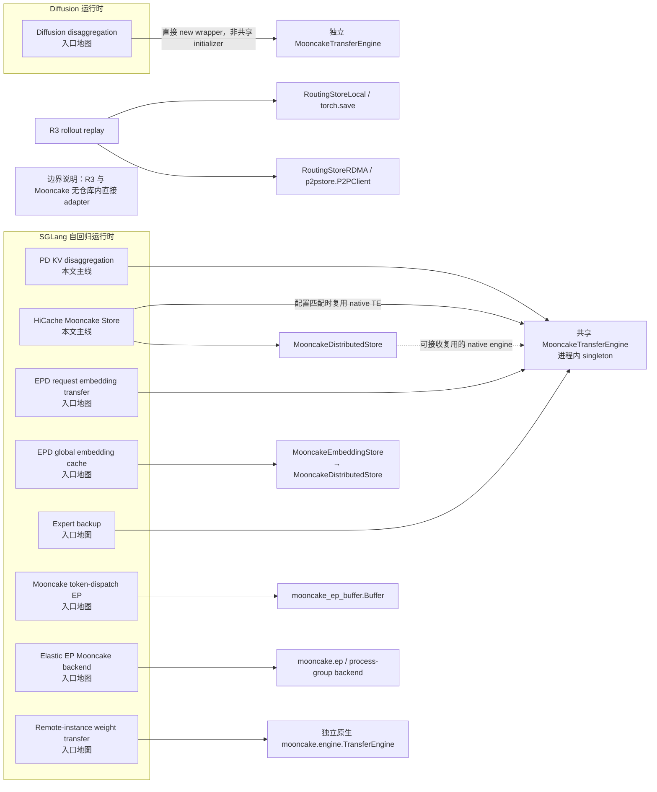
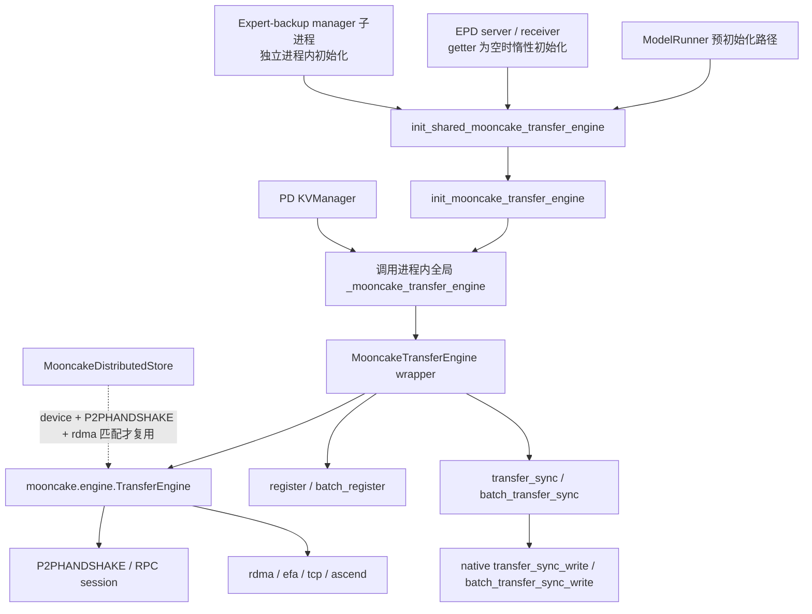
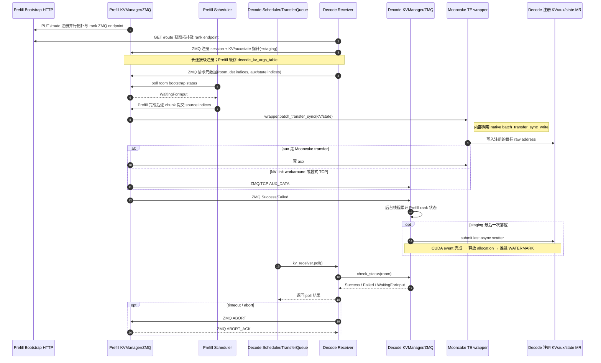
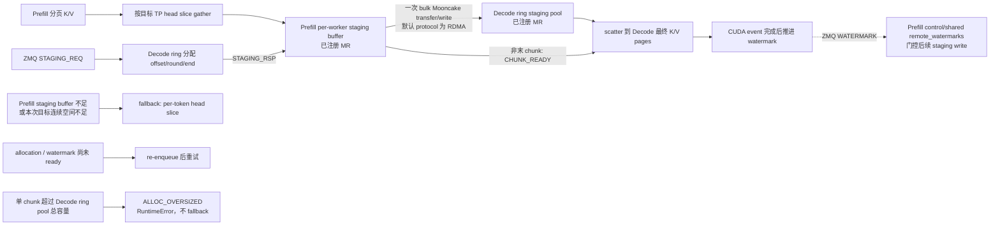
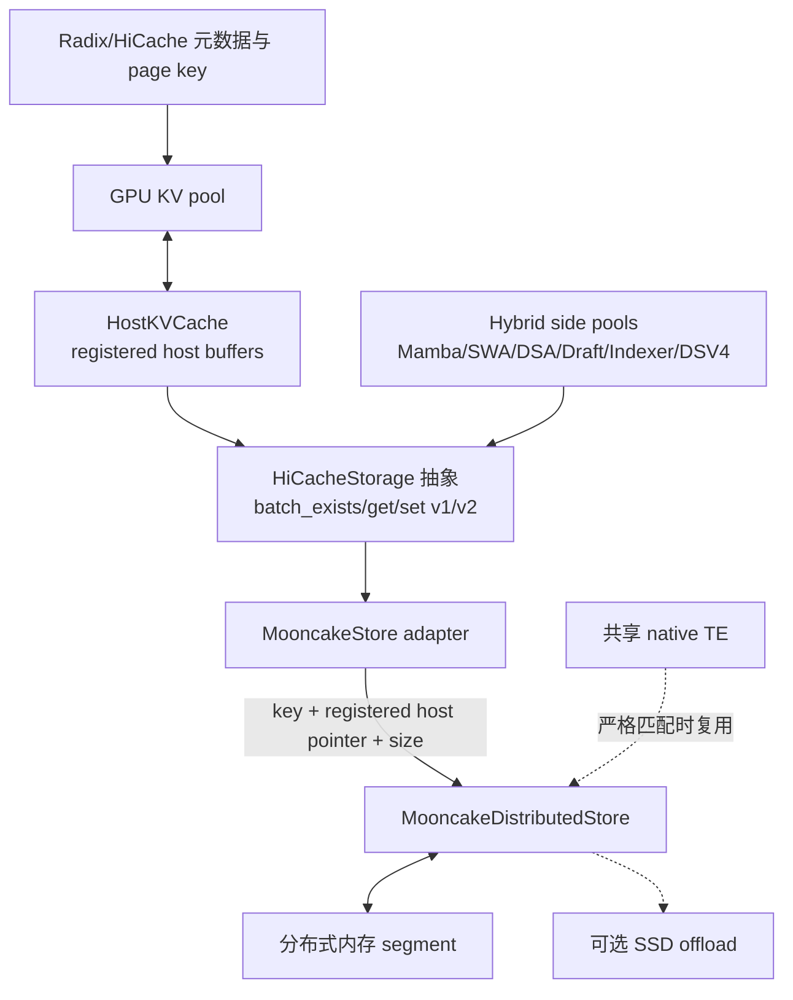
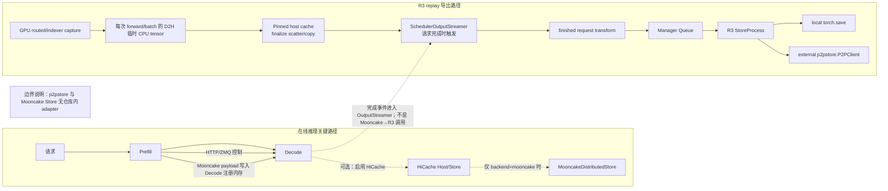
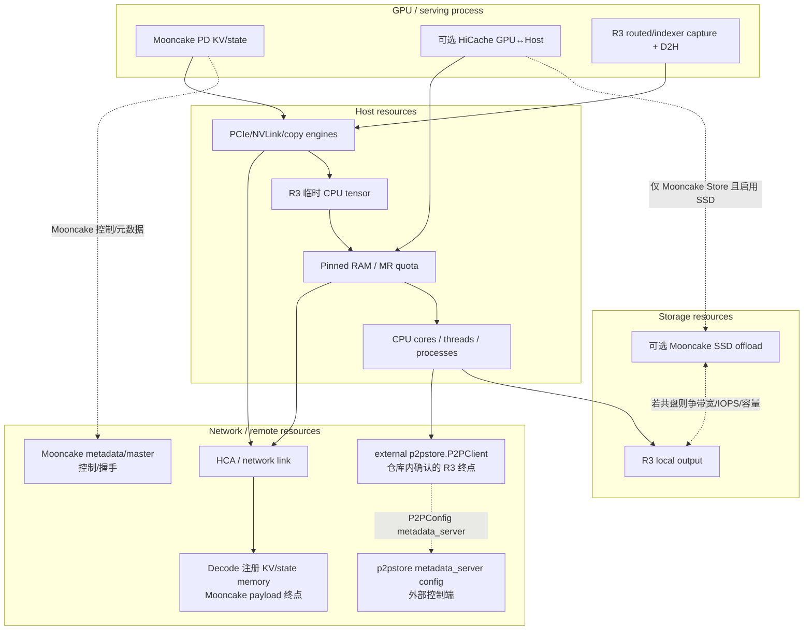

# SGLang Mooncake 架构、PD/HiCache 主线与 R3 边界

> 面向 RL 接入与研发维护人员。本文以当前仓库提交 `bcc27e770` 为静态基线，核对日期为 2026-07-11。
>
> 本文中的源码位置均为仓库根目录下的相对路径，行号对应上述提交。Mooncake、p2pstore 的外部包内部行为不在仓库源码证明范围内。

## 0. 阅读约定与最重要结论

本文对关键分析结论使用三种证据标签；表格、流程步骤和紧邻源码引用的事实段落不逐句重复标签：

- **【源码确认】**：可以由当前仓库指定文件与行号直接确认。
- **【代码推断】**：由控制流、资源所有权或接口组合推导，但尚未在目标环境测量。
- **【待运行验证】**：依赖 GPU、RDMA、Mooncake/p2pstore 版本、部署拓扑或故障注入，静态源码不足以确认。

最重要的边界是：

> **R3 local/p2pstore 不等于 Mooncake。当前仓库没有 R3 到 Mooncake 的直接 adapter，也没有 `RoutingStoreMooncake`。R3 RDMA 后端直接使用外部 `p2pstore.P2PClient`；Mooncake PD 使用 `mooncake.engine.TransferEngine`；HiCache Mooncake 后端使用 `mooncake.store.MooncakeDistributedStore`。组合部署是两个独立管线并存，不能画成 R3 直接调用 Mooncake。**

证据：R3 只在 `python/sglang/srt/internal/r3_plugin/routing_store.py:700-714` 导入并构造 `P2PClient/P2PConfig`，后端工厂只接受 `local` 与 `rdma`（同文件 `754-764`）；Mooncake TE 的绑定在 `python/sglang/srt/distributed/device_communicators/mooncake_transfer_engine.py:99-117`，Mooncake Store 的导入绑定、构造与 setup 分别见 `python/sglang/srt/mem_cache/storage/mooncake_store/mooncake_store.py:250-265,350-356,424-462`。

---

## 1. 能力地图：一套 Mooncake 名称下的多条路径



### 1.1 主线能力

| 能力 | 负载 | 控制面 | 数据面 | 主要入口 |
|---|---|---|---|---|
| PD disaggregation | KV、aux、Mamba/SWA/DSA 等 state | HTTP bootstrap + ZMQ 元数据/状态 | Mooncake 注册内存同步写；aux 可走 ZMQ/TCP | `python/sglang/srt/disaggregation/mooncake/conn.py` |
| HiCache Mooncake | Host KV page 与 hybrid side pool 对象 | HiCache 调度 + Mooncake master/client/metadata | `MooncakeDistributedStore` zero-copy batch I/O | `python/sglang/srt/mem_cache/storage/mooncake_store/mooncake_store.py` |
| R3 | routed experts / indexer top-k replay | Scheduler → manager queue → 子进程/async | 本地文件或外部 p2pstore | `python/sglang/srt/internal/r3_plugin/routing_store.py` |

### 1.2 只作入口地图的相邻能力

- **EPD request embedding transfer**：encoder 侧获取或惰性初始化共享 TE，见 `python/sglang/srt/disaggregation/encode_server.py:321-379`；receiver 同样获取/惰性初始化并可使用 embedding pool，见 `python/sglang/srt/disaggregation/encode_receiver.py:1200-1253`。
- **EPD global embedding cache**：启用后通过 `EmbeddingCacheController → MooncakeEmbeddingStore → MooncakeDistributedStore` 使用独立 Store 路径；它不传入共享 native TE，也不是 HiCache KV-page Store（`encode_server.py:305-317`；`embedding_cache_controller.py:92-129`；`mooncake_embedding_store.py:9-31`）。
- **Mooncake token-dispatch EP**：走独立的 `mooncake.mooncake_ep_buffer.Buffer` API，并非本文所述共享 TE wrapper；入口见 `python/sglang/srt/layers/moe/token_dispatcher/mooncake.py:79-146`，普通模式尚不支持见同文件 `286-317`。
- **Elastic EP Mooncake backend**：当 `elastic_ep_backend == "mooncake"` 时，Mooncake 还作为 distributed/process-group backend，并通过 `mooncake.ep` 执行成员恢复；它既不是共享 TE wrapper，也不是 token-dispatch Buffer 路径（`model_runner.py:1132-1151`；`parallel_state.py:1771-1780`；`elastic_ep/elastic_ep.py:147-170`）。
- **Expert backup**：manager 子进程显式初始化其进程内 TE，见 `python/sglang/srt/elastic_ep/expert_backup_manager.py:158-174`；client 获取共享 TE，见 `python/sglang/srt/elastic_ep/expert_backup_client.py:85-100`。
- **Remote-instance weight transfer**：`ModelRunner` 直接构造原生 `mooncake.engine.TransferEngine`、独立持有 session，并用于权重 MR 注册和远端权重传输；它绕过 wrapper singleton（`model_runner.py:641-642,694-708,995-1013`；`model_loader/loader.py:2211-2239`）。
- **Diffusion**：adapter 见 `python/sglang/multimodal_gen/runtime/disaggregation/transport/engine.py:59-110`，其直接构造 `MooncakeTransferEngine` wrapper 而不调用 singleton initializer（同文件 `66-84`）。

---

## 2. MooncakeTransferEngine：共享初始化、IB、MR 与 singleton



### 2.1 初始化与复用语义

**【源码确认】** 模块全局对象定义在 `python/sglang/srt/distributed/device_communicators/mooncake_transfer_engine.py:11-12`。初始化函数只检查对象是否已存在；存在就直接返回，否则构造并保存，见同文件 `275-292`；getter 见 `295-297`。当前只有 init/get，没有显式 reset/close；同进程 teardown 后再次初始化仍会返回旧 singleton，直至进程退出。

**【源码确认】** `ModelRunner` 在初始化流程中调用共享 TE 初始化（`python/sglang/srt/model_executor/model_runner.py:546-547`）。触发条件包括：

1. 非 null 的 PD 且 backend 为 Mooncake；
2. HiCache + Mooncake backend + `SGLANG_HICACHE_MOONCAKE_REUSE_TE`；
3. encoder-only/language-only 的 Mooncake encoder transfer；
4. `enable_elastic_expert_backup` 开启且 `elastic_ep_backend` 非空。

条件与参数位于 `python/sglang/srt/model_executor/model_runner.py:1269-1312`。IB 参数优先使用 `disaggregation_ib_device`，再回退 `mooncake_ib_device`（`1305-1311`）。复用开关默认开启（`python/sglang/srt/environ.py:388`），但这只表示初始化共享 TE 并尝试复用；未显式统一设备配置时，shared TE 的 `ib_device=None` 与 Store 默认 `device_name=""` 不相等，因此默认参数下通常不会真正复用，最终仍由 §7.3 的严格条件决定。

**【源码确认／文档偏差】** initializer 注释声称“相同 `(hostname, gpu_id, ib_device)` 才复用”（`mooncake_transfer_engine.py:280-284`），但实际实现没有参数一致性检查（`286-292`）。因此它实际是**进程内、先到先得、无配置比较**的 singleton，不是节点级或集群级 singleton。

**【代码推断】** 初始化函数没有锁；常规启动顺序大概率串行，但若多个线程首次并发调用，源码没有互斥保证。

### 2.2 IB 与 transport

**【源码确认】** IB 配置接受三种形式：共享字符串、inline JSON 的 GPU→device mapping、JSON 文件；解析与校验见 `mooncake_transfer_engine.py:15-64`，按 GPU 取值及缺项报错见 `67-96`。

**【源码确认】**：

- `MC_FORCE_TCP=1` 时 device 置空，跳过 HCA 选择（`120-125`）。
- 普通路径使用环境指定 protocol，默认 `rdma`；AWS 可用 `efa`（`184-199`）。
- native 初始化固定传入 metadata 模式 `P2PHANDSHAKE`（`200-205`）。
- Ascend 路径扩展 hostname 并强制 protocol=`ascend`（`190-195`）。
- session ID 由 hostname 与 native RPC port 构成（`127-133`）。

### 2.3 MR 与错误传播

**【源码确认】** 单 MR `register/deregister` 捕获异常，仅 debug log，且不返回状态，见 `mooncake_transfer_engine.py:135-153`。`batch_register` 返回状态，并在缺少 native `batch_register_memory` API 时提示升级（`:155-170`）；`batch_deregister` 捕获所有异常、仅 debug log 并返回 `-1`，没有对应的缺 API 升级提示（`:172-182`）。

**【源码确认】** PD manager 获取共享 engine 后批量注册 KV、aux、每组 state buffer，见 `python/sglang/srt/disaggregation/mooncake/conn.py:247-267`。

**【代码推断】** PD 注册路径没有检查 `batch_register` 返回值，也未在 manager 中看到对称的 deregister 生命周期；失败可能延后到第一次传输才暴露。

**【待运行验证】** 应注入 MR 失败，确认是否需要启动期 fail-fast，并验证模型 runner 重建/进程长驻时的 MR 回收与 native engine 清理。

---

## 3. PD 三平面：HTTP bootstrap、ZMQ 控制、Mooncake 数据

这里应避免把“bootstrap”泛化成一个协议。当前实现明确分为：

1. **HTTP bootstrap/健康面**：发现拓扑与 rank endpoint；
2. **ZMQ 控制面**：交换 session、指针、indices、状态、abort、staging watermark；
3. **Mooncake 数据面**：按 session + raw address 写注册内存。

### 3.1 HTTP bootstrap

**【源码确认】** Common manager 为每个 rank 绑定 ZMQ PULL socket，并记录本地 IP/port，见 `python/sglang/srt/disaggregation/common/conn.py:93-135`。

Prefill 通过 HTTP PUT `/route` 注册 TP/CP/DP/PP、rank IP/port、page size、KV dtype 等，见同文件 `371-427`。Decode 先通过 GET `/route` 获取全局并行信息（`217-260`），再按目标 rank 查询具体 endpoint（`977-994`）。Bootstrap server 注册 `/route` 与 `/health`，见同文件 `1122-1174`。

多节点 Prefill 会把 world-rank-0 的 bootstrap port 广播到其他 rank，避免各节点自动端口不一致，见 `341-369`。

### 3.2 ZMQ 控制面

**【源码确认】** Decode 首次注册发给 Prefill 的信息包括：Mooncake session ID、KV/aux/state 目标指针、目标 TP、item length、state 维度及可选 staging base/size，结构见 `python/sglang/srt/disaggregation/mooncake/conn.py:119-159`，发送见 `1787-1840`。

每个请求再发送 room、目标 KV indices、aux index、state indices、期望目的端数量、decode prefix length，见同文件 `75-116` 与 `1842-1888`。

ZMQ 还承载：

- transfer success/failure 回报（`1134-1144`、`1520-1547`）；
- `ABORT/ABORT_ACK`（`1404-1441`、`1513-1518`）；
- staging 的 `STAGING_REQ/STAGING_RSP/CHUNK_READY/WATERMARK`（`1388-1403`、`1487-1511`）。

### 3.3 Mooncake 数据面

**【源码确认】** `_transfer_data` 将 source pointer、destination pointer、length 列表交给共享 engine 的 `batch_transfer_sync`，见 `python/sglang/srt/disaggregation/mooncake/conn.py:565-572`。wrapper 最终调用 native `batch_transfer_sync_write`，见 `python/sglang/srt/distributed/device_communicators/mooncake_transfer_engine.py:231-260`。

### 3.4 PD 请求时序



---

## 4. Prefill 与 Decode 生命周期

### 4.1 Prefill

1. **启动**：`CommonKVManager.__init__` 先绑定 rank ZMQ PULL socket，并在 Prefill 模式下同步 bootstrap port、通过 HTTP PUT `/route` 注册 rank（`common/conn.py:130-164,341-427`）；返回后 `MooncakeKVManager` 才获取共享 TE、注册 KV/aux/state MR、启动 Prefill ZMQ 接收线程，最后创建 transfer queues/executors 并启动 workers（`mooncake/conn.py:172-238`）。
2. **等待 Decode 注册**：`room == "None"` 时写入 `decode_kv_args_table`，并清除该 session 的失败记录（`1442-1455`）。
3. **请求 bootstrap**：收齐 `required_dst_info_num` 后将 room 更新为 `WaitingForInput`（`1457-1475`）。
4. **发送**：sender 将 chunk 放入按 destination session port 分片的 queue（`1551-1599`），worker 选择常规、staging 或逐 token slice 路径（`1242-1287`）。
5. **最后一个 chunk**：先调用 `maybe_send_extra()` 发送 state，再发送 aux；函数内部虽聚合并返回 state 错误码，但调用方丢弃该返回值，目的 rank 的最终 Success/Failed 实际只由各 destination registration entry 的 `send_aux()` 返回值汇总（`915-1027,1312-1343`）。该路径不接收目的端数据 acknowledgement。
6. **请求级完成/清理**：成功后移除该 room 的 transfer info 与 prefix 信息，scheduler 随后通过 sender/receiver `clear()` 清请求状态和 response trackers（`mooncake/conn.py:1367-1373`；`common/conn.py:846-851,1078-1081`）。这不是 manager shutdown：共享 TE、长期 MR、ZMQ sockets、receiver/heartbeat/worker/probe threads 与 executors 没有完整对称的 close/deregister/shutdown 路径，主要依赖进程退出。

### 4.2 Decode

1. **拓扑发现**：HTTP 获取 Prefill 并行信息并计算 TP/CP/PP rank mapping（`common/conn.py:217-339`）。
2. **连接级注册**：第一次连接向 Prefill 发送 raw pointers 与 session（`mooncake/conn.py:1787-1840`）。
3. **请求级分配**：Decode 为请求分配目标 indices 后发送 metadata（`1842-1888`）。
4. **等待传输与落位完成**：Decode 接收并去重 Prefill rank 状态；普通路径收齐预期 Success 后可完成。staging 路径此时仅提交最后一次异步 scatter；在 CUDA event 完成、allocation 释放并推进 watermark 前，scheduler 侧仍暴露 `Transferring`，之后才最终暴露 Success（`mooncake/conn.py:1520-1547`；`common/staging_handler.py:223-284`；`disaggregation/utils.py:138-166`）。
5. **失败**：waiting timeout 或显式 abort 会 best-effort 发 `ABORT`（`common/conn.py:1050-1119`）。

**【代码推断】** 控制面状态完成意味着 SGLang 已收到预期的 Prefill completion，不代表应用外部的网络 telemetry 已完全归档；故障排查应关联 room、session 与 trace，而非只看 HTTP 请求状态。

---

## 5. KV、aux、hybrid state 与异构 TP

### 5.1 MHA/MLA 与 PP

**【源码确认】** generic KV path 先合并连续 indices，再构造跨层 transfer blocks；MHA 分 K/V，MLA 使用单组指针，并处理 PP slicing，见 `mooncake/conn.py:574-680`。MHA/MLA 的 PP pointer mapping 分别位于 `common/conn.py:436-496`；compressed-MLA 特殊布局位于 `498-598`。

### 5.2 aux

**【源码确认】** aux 仅在最后 chunk 发送（`mooncake/conn.py:1312-1327`）。默认按 pointer block 经 Mooncake 写入（`823-845`）；当 custom pool 为 NVLINK 或设置 `SGLANG_MOONCAKE_SEND_AUX_TCP` 时，序列化后走 ZMQ/TCP（`847-913`）。因此“PD 所有数据都走 RDMA”是不准确的。

### 5.3 hybrid state

**【源码确认】** `maybe_send_extra` 按 `StateType` 分派（`mooncake/conn.py:915-1027`）：

- Mamba：同 TP 直接传，异构 TP 可按状态张量第三维切片（`1029-1132`）；
- SWA/DSA：复用 generic KV path；
- 非 MLA 的 SWA/DSA 在 P/D TP 不同场景显式报不支持（`993-1002`）。

**【待运行验证】** Mamba 异构 TP 缺少维度元数据时会退回普通 transfer（`1079-1088`）；这一 fallback 的运行正确性必须用真实模型验证，静态源码不能证明数据布局仍匹配。

### 5.4 异构 TP staging

默认非 staging 路径会按 token slot、layer 与 head slice 生成传输，强调通用正确性但可能增加 TTFT，见 `mooncake/conn.py:700-821`。

staging 默认关闭，Prefill 每 worker 64 MiB、Decode pool 4096 MiB，见 `python/sglang/srt/environ.py:371-374`。它只用于非 MLA；Prefill/Decode guard 分别见 `python/sglang/srt/disaggregation/prefill.py:140-144`、`decode.py:324-329`。



**【源码确认】** gather + bulk write 在 `mooncake/conn.py:468-563`；readiness、fallback、`CHUNK_READY` 在 `380-438`；选择顺序为 MLA/同 TP常规路径 → staging → slice（`1242-1287`）。

**【待运行验证】** 需要覆盖 TP 两个方向、page size>1、GQA 的 KV heads<TP、ring wrap/watermark、多 writer 最终 scatter、Prefill staging buffer 或本次目标连续空间不足时的 slice fallback、allocation/watermark pending 时的 retry、单 chunk 超过 Decode ring pool 总容量时的 fatal 路径，以及 abort 时 gather/transfer/scatter 正在执行的竞态。

---

## 6. 可靠性：timeout、abort、heartbeat、blacklist 与 trace

### 6.1 两类 timeout

| 状态 | 所在侧 | 含义 | 默认 | 源码 |
|---|---|---|---:|---|
| `Bootstrapping` timeout | Prefill sender | 未收到 Decode 的目标 metadata/indices | 300s | `common/conn.py:821-838`；默认 `environ.py:297` |
| `WaitingForInput` timeout | Decode receiver | bootstrap 后未收到 KV 完成信号 | 300s | `common/conn.py:1050-1073`；默认 `environ.py:300` |

Decode waiting timeout 会标失败并 best-effort 通知 Prefill abort；Prefill 收到后标记未完成 room failed 并回复 ACK（`mooncake/conn.py:1404-1441`）。Decode 对 ACK 目前仅记录，deferred release 仍是 TODO（`1513-1518`）。

### 6.2 heartbeat 与 session blacklist 是两层机制

**【源码确认】** Decode 的 HTTP heartbeat 调用 Prefill `/health`，interval 至少 2 秒、failure threshold 至少 1；实现见 `common/conn.py:600-647`，配置采集见 `165-187`。达到阈值后 Mooncake manager 清连接/并行信息，并将相关未完成 room 标失败（`mooncake/conn.py:1648-1677`）。

**【源码确认】** Prefill 的 native session blacklist 不同于 HTTP heartbeat：一次主 KV chunk transfer failure 即将 Mooncake session 加入 `failed_sessions`（`1288-1309`），后续同 session 工作提前失败（`1208-1226`）。state 的返回值当前未检查，aux failure 影响请求状态但不触发该 blacklist。新一轮 KV args 注册会解除 blacklist（`1442-1454`）。

可选的主动 probe 默认关闭；配置见 `environ.py:383-384`，probe loop 见 `mooncake/conn.py:1611-1646`。`send_probe==0` 时解除 blacklist 并增加 `sglang:failed_session_recoveries_total`（metric 定义 `59-62`）。

**【代码推断】** HTTP heartbeat 回答“bootstrap node 是否可达”，Mooncake probe 回答“native session 是否恢复”，二者不能互相替代。

### 6.3 trace

**【源码确认】** Mooncake 定义 send、recv、worker send、per-session send、worker recv 阶段，见 `python/sglang/srt/observability/mooncake_trace.py:11-31`；slice helper/decorator 在 `34-68`。sender 以 bootstrap room 的十六进制值建立 trace context（`mooncake/conn.py:1755-1768`），worker 重建线程上下文并记录 per-session slice（`1146-1183`、`1350-1362`），abort 写入原因并结束 trace（`1770-1773`）。

**【待运行验证】** 应将 trace 与 ZMQ room、Mooncake session、HTTP bootstrap endpoint 一起采集；单看 trace stage 无法区分 HCA 拥塞、目的 MR 错误或控制面未收齐 rank。

---

## 7. HiCache MooncakeDistributedStore

### 7.1 层级与数据流



`HiCacheStorage` 抽象与 v1/v2 API 位于 `python/sglang/srt/mem_cache/hicache_storage.py:138-308`；Mooncake backend 在 factory 注册于 `python/sglang/srt/mem_cache/storage/backend_factory.py:192-207`，构造分支见 `160-167`。

### 7.2 配置优先级与模式

**【源码确认】** `MooncakeStoreConfig` 包含 hostname、metadata server、segment size、protocol/device、master/client、standalone 与 SSD offload，见 `mooncake_store.py:88-102`。配置按**整份来源**选择，而不是逐字段合并：

1. `storage_config.extra_config` 中 `master_server_address` 或 `client_server_address` 的值只要不是 `None`，即选择 extra-config 分支；空字符串也会触发；
2. 否则，若设置 `SGLANG_HICACHE_MOONCAKE_CONFIG_PATH`，从文件加载；
3. 否则从环境变量加载。

见同文件 `267-287`。文件/env/extra_config 的字段映射分别见 `104-158`、`161-199`、`202-247`。选中 extra-config 或文件后，缺失字段使用该 loader 的默认值，不会继续从较低优先级来源补齐。因此只设置 `extra_backend_tag` 或 SSD 开关不会选择 extra-config 分支；把地址设为空字符串则会选择该分支，但可能产生无效配置。

配置文件环境变量的真实名称是 `SGLANG_HICACHE_MOONCAKE_CONFIG_PATH`，定义于 `python/sglang/srt/environ.py:386-388`，加载判断位于 `mooncake_store.py:279-280`。Mooncake README `:196` 所写的 `DEFAULT_MOONCAKE_CONFIG_PATH_ENV` 并不存在；README 自己在 `:211-214` 给出的实际使用示例则采用了正确名称。

### 7.3 复用共享 TE 的精确边界

**【源码确认】** 非 standalone 模式才尝试获取共享 TE；只有同时满足以下条件才把 native engine 传给 `MooncakeDistributedStore.setup`：

- shared TE 非空；
- `device_name == shared_te.get_ib_device()`；
- metadata server 为 `P2PHANDSHAKE`；
- protocol 为 `rdma`。

见 `mooncake_store.py:411-443`。不匹配时，SGLang 只确认向外部 `MooncakeDistributedStore.setup()` 传入 `transfer_engine=None`；外部包是否创建并拥有另一 native engine、其销毁顺序如何，当前仓库无法证明。SGLang adapter 的 `close()` 还是 no-op（`:1163-1166`）。这与共享 initializer 无条件返回旧对象形成鲜明对比。

### 7.4 standalone、SSD 与 warmup

**【源码确认】** standalone 要求 `MooncakeHostTensorAllocator`，汇总 KV 与 hybrid sidecar 所需总字节后调用外部 Store 的 `setup_dummy(..., client_server_address)`，见 `302-348,398-410`。其设计目标是供真实 Mooncake client 映射 host buffers；实际跨进程映射属于外部 Mooncake 行为，当前仓库尚未运行验证，不应与普通共享 TE 模式混淆。

SSD offload 只作为 `setup` 可选 kwargs 传入。捕获 `TypeError` 后，代码从异常文本中识别不支持的 SSD kwarg，删除识别出的参数并重试；若异常文本没有包含任何待传 kwarg 名称，则重新抛出（`444-477`）。因此“配置了 SSD 路径”不等于“运行时实际启用”，需要检查 warning 与实际层级命中。

setup 后执行 warmup：以随机 key 写入 4 KiB，put 最多尝试 10 次、失败后间隔 1 秒，随后 assert exist/get，见 `484-488`、`588-613`。成功后源码没有删除该随机 key，因此每次 Store 初始化会遗留一个唯一的 4 KiB warmup object；现有 `clear()` 只提供全库 `remove_all()`（`:1168-1169`）。

### 7.5 key-pointer-layout 契约

Mooncake Store 的核心不是“传一个 tensor”，而是严格对齐：

```text
logical page key
  -> token-page 链式 SHA-256 key + TP/head-split/PP/KV/pool suffix
  -> Mooncake backend 不自动加入 model identity；多模型共享时用 extra_backend_tag 等显式隔离
  -> host pool 返回同顺序 pointer 与 element size
  -> zero-copy batch put/get 将三者 zip
```

**【源码确认】** hybrid key 后缀顺序必须匹配 `get_page_buffer_meta()`，因为 Mooncake 会把 object key 与 registered pointer 对齐，见 `mooncake_store.py:654-716`。Mamba 展开为 temporal + 多个 conv；Draft 根据自身 MHA/MLA 类型生成独立后缀；SWA、Indexer、DSV4 side pool 各有规则。

hybrid v2 I/O 根据各个 `PoolTransfer` 展开 side-pool object keys，并从对应 host pool 取得同序 pointer/size；set 仅写缺失对象，get 直接 zero-copy，见 `773-828`。主 KV 走 v1 路径：`batch_get_v1()`/`batch_set_v1()` 经 `_batch_preprocess()` 展开元数据，MHA 每页通常生成 K/V 两个 object，MLA 每页生成一个 K object，见 `830-900,933-1009`。MLA 及部分 side pool 可把多个底层 pointer 打包为一个 object 的 multi-buffer metadata，见 `844-865,1171-1187`。

**【源码确认】** host buffer 注册覆盖 anchor 与 hybrid side pools，见 `614-647`；standalone 所需字节也显式包含 hybrid pool（`304-348`）。HiCache detach 会停止控制器并丢弃 backend，但 `MooncakeStore.close()` 当前为空操作，资源释放依赖外部 `MooncakeDistributedStore` 析构，且 SGLang 没有显式 deregister 已注册 host buffers（`mooncake_store.py:1163-1166`）。重复 attach/detach 和进程退出后的 MR、segment、SSD 资源回收需运行验证。

### 7.6 MHA、MLA、hybrid、layout 边界

- MHA key 使用 rank/PP suffix 并拆 K/V（`867-878`）。
- MLA 使用 PP suffix 与单 K object，并支持 multi-buffer packing（`880-889`）。
- hybrid v2 按 pool 名称扩展 page object（`654-716`）。
- 当 storage backend 为 Mooncake 且请求 `layer_first` 时，启动归一化会在 `direct` IO 下改为 `page_first_direct`，在 `kernel` IO 下改为 `page_first`；对未知 IO backend（源码注释举例 `kernel_ascend`）则保留 `layer_first`，但仍打印 warning，见 `python/sglang/srt/server_args.py:3785-3804`。因此常规 direct/kernel 路径不会最终保持 `layer_first`，但不能表述为所有路径绝对禁止。Store 内已有 MLA 及部分 side-pool multi-buffer 路径（`mooncake_store.py:844-889,1171-1187`）；普通 MHA 的 key/pointer 数量不匹配仍被拒绝（`:867-878`）。
- standalone 是 allocator/client 拓扑边界，不是 MHA/MLA 功能开关。
- SSD 是 Mooncake Store 下层可选 offload，不是 SGLang HiCache 的独立直接数据面；SSD kwargs 不传给 `setup_dummy()`（`398-410,444-477`）。
- CLI 接受的 host-memory layout 实际有 `layer_first`、`page_first`、`page_first_direct`、`page_first_kv_split`、`page_head` 五种（`python/sglang/srt/server_args.py:6303-6312`）。Mooncake README `:297` 只列前三种，不能当成完整 CLI enum；其中 `page_head` 还用于异构 TP 的 head splitting，因此需按具体 backend/model 能力判断兼容性。
- 配置的 `global_segment_size` 是所有 TP rank 的总贡献目标；每个 rank 实际贡献 `global_segment_size // tp_size`（`mooncake_store.py:364-368`）。README `:251` 的 “`1/global_segment_size` memory” 是错误表述，应理解为每 rank 贡献 `1/tp_size`，总和约为配置值。

**【待运行验证】** 必须用目标 Mooncake 版本验证 SSD 参数确实生效、standalone client 映射 hybrid buffers、key/pointer 数量在 MHA/MLA/DSV4/Draft 组合中完全一致；还应验证 MLA layer-first multi-buffer 是否可由 runtime attach 路径实际到达。

---

## 8. R3 对照：两套数据面与控制面

### 8.1 R3 生命周期

**【源码确认】** 每个 R3 enabled、config 存在且满足 `pp_rank==0 && attn_tp_rank==0` 的 Scheduler 都会创建自己的 store wrapper，见 `python/sglang/srt/managers/scheduler.py:586-602`。该条件不限制 DP rank，因此 DP attention/多副本部署中可能有多个 owner 与 StoreProcess；R3 key/path 不自动加入 DP rank，RID 必须跨 producer 保持唯一或由上层明确分片。完成请求在 normal output streaming 后提交 R3，见 `python/sglang/srt/managers/scheduler_components/output_streamer.py:94-108`。

R3 的 wrapper 创建 manager-backed bounded queue、monitor thread 与 StoreProcess，见 `routing_store.py:100-174`。提交使用 `put_nowait`，queue 满会抛错（`192-224`）；非 debug 完成路径捕获并 warning（`282-307`）。子进程建立 asyncio event loop 与最多 5 个线程池 worker（`404-528,569-622`），但 worker 只负责把 coroutine 提交到 event loop：线程池任务返回后 queue 即 `task_done()`（`439-481`），不代表 backend put/delete/clear 已完成；callback 也未调用 `future.result()`（`518-528`），所以 `Queue.join()` 与 “Async task completed” 均不能作为持久化成功证明。shutdown 没有保留或 await 这些 backend futures；超时 join 后还在存活时直接调用 `Process.close()`（`:136-160`），其强制退出生命周期需要修正并做故障验证。

### 8.2 后端

- **Local**：`torch.save` 到 rollout/replay-kind 路径，见 `routing_store.py:653-687`；整库 clear 删除目录，prefix batch delete 未实现（`689-697`）。
- **RDMA/p2pstore**：构造 `P2PConfig(metadata_server=rdma_store_server)` 与 `P2PClient`（`700-714`），put/delete/clear 见 `716-751`。
- 工厂只有 `local` 与 `rdma`（`754-764`）。

### 8.3 对照表

| 维度 | R3 local | R3 p2pstore | Mooncake PD | Mooncake HiCache |
|---|---|---|---|---|
| 语义 | rollout replay 落盘 | rollout replay 对象写入 | 请求内 KV/state 搬运 | 可复用 cache page 存储 |
| payload | routed experts（默认）；indexer top-k（`replay_kinds` 可选） | 同左 | KV、aux、hybrid state | KV page 与 side pool |
| 寻址 | 目录/文件 | rollout-derived key | session + raw dst pointer | cache object key |
| 控制面 | Scheduler + manager queue | 再加外部 metadata server | HTTP + ZMQ + Mooncake handshake | HiCache + master/client/metadata |
| 数据面 API | `torch.save` | `P2PClient.put` | wrapper `batch_transfer_sync` → native `*write` | `MooncakeDistributedStore` |
| 生命周期 | 请求完成后异步导出 | 同左 | Prefill→Decode 请求关键路径 | cache prefetch/backup |
| 直接 adapter | 无 | 无 | 不适用 | 可复用 Mooncake native TE，但不是 R3 |

### 8.4 两套管线必须并列建模



**【源码确认】** R3 capturer 使用 GPU `int32` device buffer，并常驻分配 pinned host cache（`python/sglang/srt/state_capturer/base.py:20-76`）。D2H/finalize 是每次 captured forward/batch 的路径：overlap 模式先把 GPU slice 与 cache locations 转成临时 CPU tensors，等待 copy event 后由 `finalize()` scatter/copy 到 pinned host cache（`base.py:79-95,162-184`；`python/sglang/srt/managers/utils.py:114-117`；`python/sglang/srt/managers/scheduler_components/batch_result_processor.py:186-193`）。请求完成后才由 `SchedulerOutputStreamer` 触发 request gather/transform/store submission。

**【待运行验证】** 外部安装的 `p2pstore` 是否内部复用了 Mooncake、同一 verbs provider 或共享 native library，当前仓库不能证明或排除；需检查安装包、动态库、进程、endpoint 与 HCA binding。但即便外部实现复用，也不能据此把 SGLang 源码架构画成 R3→Mooncake adapter。

---

## 9. R3 + Mooncake 组合部署拓扑与资源竞争



### 9.1 竞争清单

**【代码推断】** 以下风险由资源所有权直接推导，但必须压测量化：

1. **HCA/NIC/PCIe**：Mooncake PD 大块注册内存写与 R3 p2pstore 导出可能共享 HCA；仓库没有跨管线带宽调度器。
2. **Pinned RAM 与 MR quota**：R3 capturer 常驻 pinned host tensor；HiCache 持有并注册 Host KV pool，standalone 还用 Mooncake host allocator。
3. **GPU copy engine**：启用相应 capturer 时，R3 每 captured forward/batch 的 D2H 与 Mooncake staging gather/scatter、GPU-direct transfer 可能重叠。
4. **CPU**：Mooncake 有 transfer queue/executor/bootstrap/decode/probe threads；R3 增加 manager、子进程、monitor、event-loop 与 worker pool。
5. **瞬时内存放大**：R3 可同时存在 capture tensor、D2H 临时 CPU tensor、常驻 pinned host cache、NumPy contiguous 与 manager queue 序列化对象；routing 默认 padding 到 `max_model_len` 会放大短请求，indexer 默认 no-pad。只有 fused 3-D p2pstore payload 在仓库内显式 `.tobytes()`；外部 p2pstore 是否额外分配 transport buffer 未由本仓库确认。
6. **disk**：R3 local 的 `torch.save` 若与 Mooncake SSD offload 共盘，会争 IOPS、吞吐与容量。
7. **backpressure**：R3 `put_nowait` 满队列可丢导出任务，而在线推理可能继续；Mooncake 拥塞可间接放大该问题。

**【待运行验证】** p2pstore 的 HCA 选择、重试、MR 与 metadata 行为在外部包中；必须单独确认是否能与 Mooncake 做 HCA/NUMA/CPU/disk 隔离。

---

## 10. 分层验证方案

### L0：静态与配置

- 固定仓库、Mooncake、p2pstore、driver/OFED 版本。
- 展开最终 server args 与环境变量；验证 P/D page size、KV dtype、TP/CP/PP mapping。
- 验证共享 TE 的首个初始化参数，防止 singleton 静默复用错误 IB。
- 明确 R3 `local|rdma`、replay kinds、fused/no-pad、metadata endpoint。
- 预算 GPU、pinned RAM、MR、HCA、CPU、SSD。

### L1：TE 单体

- 每 GPU IB mapping、session 建立、单/批 MR、单/批 transfer。
- 两次不同参数初始化，确认实际静默复用行为是否可接受。
- 注入 MR failure、RPC/session failure、并发首次初始化、teardown/recreate。

### L2：PD 控制面

- 仅测 HTTP `/route` 注册/查询、multi-node bootstrap port 同步、`/health`。
- 仅测 ZMQ 注册、room 状态机、rank 数量、abort/ACK、timeout。
- 验证 page size/KV dtype mismatch 能启动期或请求期明确报错。

### L3：PD 数据面

- MHA、MLA、PP、aux RDMA/TCP、Mamba/SWA/DSA。
- 异构 TP 两方向、staging on/off、pool 不足 fallback、ring wrap、多 writer。
- 故障矩阵：发送前、active native transfer、scatter 中、完成状态发送前后 abort。
- heartbeat 与 session blacklist/probe 分别注入故障。

### L4：HiCache

- File backend 先验证 HiCache 本身，再切 Mooncake。
- 配置来源三种路径；共享 TE 匹配与不匹配各测一次。
- MHA/MLA/hybrid key-pointer-size 数量与顺序检查。
- standalone allocator/client 映射、warmup race、SSD 新旧版本 fallback；重复 attach/detach、进程退出和 MR/segment/SSD 资源计数。
- 验证真实 cache hit 与数据一致性，不能只看 warmup 成功。

### L5：R3

- 先测 capture correctness，再测 local store 文件与 tensor 内容。
- 再测真实 p2pstore put/readback/delete/clear；不要只信 “Async task completed” log。
- 注入 queue full、metadata server outage、慢存储、进程退出与非空队列。
- `only_last_turn` + local 需特别注意 local prefix delete 未实现。

### L6：组合矩阵

至少比较：

1. 全关；
2. Mooncake only；
3. R3 local only；
4. R3 p2pstore only；
5. Mooncake + R3 local；
6. Mooncake + R3 p2pstore。

每组采集 TTFT、ITL、吞吐、Mooncake transfer latency/failure、blacklist/probe、R3 queue depth/完整率、HCA counters、PCIe/copy engine、CPU、pinned RAM/MR、SSD IOPS。组合验收必须检查 R3 目的端对象完整性和 Mooncake KV/cache 数据正确性。

---

## 11. 现有测试覆盖与空白

### 11.1 Mooncake/PD/HiCache 已有覆盖

- 手工 TE gating 与 per-rank 初始化脚本（不完整覆盖 shared-singleton 参数一致性）：`test/manual/kv_transfer/test_mooncake_transfer_engine_init.py:44-142,215-242,245-356`。
- 手工 native benchmark wrapper：`test/manual/kv_transfer/test_mooncake_transfer_engine.py:1-64`。
- 异构 TP staging 的端到端 accuracy smoke 场景（不是 MR 注册断言测试）：`test/registered/disaggregation/test_disaggregation_different_tp.py:338-504`。
- tracing：`test/registered/observability/test_tracing_disaggregation.py:18-19,213-233`。
- Mooncake HiCache backend：`test/registered/hicache/test_hicache_storage_mooncake_backend.py`。
- speculative + Mooncake storage：`test/registered/hicache/test_hicache_spec_mooncake_storage.py`。
- standalone/Mamba 的 `setup_dummy` 容量计算单元覆盖（使用 fake Store；不覆盖真实 client 映射、buffer 注册、跨进程 I/O 或资源生命周期）：`test/registered/unit/mem_cache/test_mooncake_standalone_dummy_mamba.py`。
- Mooncake EP 与 expert backup：`test/registered/ep/test_mooncake_ep_small.py:20-114`、`test/manual/ep/test_mooncake_expert_backup.py:17-139`。

### 11.2 R3 覆盖边界

**【源码确认】** routed expert 与 indexer capture 有注册测试，例如 `test/registered/rl/test_return_routed_experts.py:42-274,352-539` 与 `test/registered/rl/test_return_indexer_topk.py:35-142`。

**【源码确认】** 未发现直接覆盖 `RoutingStoreLocal`、`RoutingStoreRDMA`、`create_routing_store`、真实 p2pstore 写删、以及 R3+Mooncake 联合启用的注册/单元测试。现有 capture 测试不能替代 store durability 与组合资源验证。

### 11.3 优先补齐的空白

1. singleton 参数不一致与并发首次初始化；
2. MR 失败、部分注册与 teardown；
3. abort/timeout 与 active transfer/staging scatter 竞态；
4. blacklist probe 恢复与 metric；
5. hybrid unequal-TP，尤其 Mamba metadata fallback；
6. HiCache shared TE mismatch、standalone hybrid、SSD 实际生效；
7. R3 local/p2pstore readback、async failure observability、queue full；
8. R3+Mooncake 组合压测与 fault matrix。

---

## 12. 已确认的测试/文档偏差与维护提醒

1. **TE initializer 注释与实现不一致**：注释说相同配置复用，代码无条件复用已有 singleton。证据：`mooncake_transfer_engine.py:280-292`。
2. **Mooncake Store README 的配置说明存在三处明确偏差**：`README.md:195-196` 将任意 extra config 都描述为最高优先级，并引用不存在的 `DEFAULT_MOONCAKE_CONFIG_PATH_ENV`；实际只有 extra config 含 `master_server_address` 或 `client_server_address` 才选中该分支，配置文件变量是 `SGLANG_HICACHE_MOONCAKE_CONFIG_PATH`（`mooncake_store.py:267-285`；`python/sglang/srt/environ.py:386-388`）。另外，README `:251` 的 TP 内存分摊公式表述错误，源码实际是 `global_segment_size // tp_size`（`mooncake_store.py:364-368`）。
3. **Mooncake Store README 的 layout enum 不完整**：`README.md:297` 仅列出三种 layout，CLI 还接受 `page_first_kv_split` 与 `page_head`（`python/sglang/srt/server_args.py:6303-6312`）；应区分“完整 CLI choices”和“Mooncake 普通路径支持边界”。
4. **PD 文档 thread pool 默认公式已陈旧**：文档写 `int(0.75 * os.cpu_count()) // 8`，见 `docs/advanced_features/pd_disaggregation.md:145-149`；当前 Mooncake 代码使用 `int(0.5 * cpu_count) // 8`，再 clamp 到 `[4,12]`，见 `mooncake/conn.py:183-200`。
5. **“Mooncake 数据都走 RDMA”不成立**：aux 在 NVLINK workaround 或环境开关下走 ZMQ/TCP，见 `mooncake/conn.py:823-913`。
6. **“开启 SSD 配置即生效”不成立**：旧版本不支持 kwargs 时会去参重试，见 `mooncake_store.py:444-477`。
7. **R3 async completion 会掩盖 coroutine failure**：`_on_async_task_completed()` 不调用 `future.result()`/`future.exception()`，backend coroutine 以异常完成时仍会记录 “Async task completed”（`routing_store.py:518-528`）。queue `task_done()` 也只表示 coroutine 已提交到 event loop，不表示后端完成；shutdown 不 await backend futures（`:439-512,136-160`）。是否丢写仍需通过慢/失败 backend 与 readback 验证。
8. **R3 local + only_last_turn 确定不受支持**：`only_last_turn=true` 会提交 prefix-clear task，而 `RoutingStoreLocal.clear_prefix_batch()` 恒抛 `NotImplementedError`（`routing_store.py:363-386,653-697`），且异常会被上一项 callback 行为掩盖。应拒绝该组合或实现并测试 local 删除。
9. **PD hybrid state 传输返回值可能未参与最终状态**：worker 调用 `maybe_send_extra()` 后没有接收返回值（`mooncake/conn.py:1312-1319`），随后以 aux 结果决定完成状态（`1321-1343`），而该函数本身会返回累计错误码（`915-1027`）。这是源码行为；“state 写失败但请求仍报成功”的影响属于代码推断，需故障注入验证。
10. **bootstrap 注册计数按请求递增而非按唯一 rank 计数**：handler 每次 PUT 都增加 `_registered_count`（`common/conn.py:1233-1245`），ready 仅比较计数与预期值（`1153-1165`）。重复注册是否可能导致提前 ready 需运行验证。
11. **R3 CLI help 与实际启用条件不一致**：`--r3-p2pstore-config` help 声称提供配置即启用（`server_args.py:6823-6831`），但 Scheduler 仍要求 `enable_r3_p2pstore` 为真（`scheduler.py:586-602`）。

---

## 13. 接入与故障排查速查

### RL 接入前

- R3 存储 routing/indexer replay tensor payload 及其 key/layout contract；它不存模型 KV/state tensor，不承担 KV disaggregation，也不替代 HiCache。
- 若训练侧需要 R3 数据，必须先定义 key、dtype、shape、fused/per-layer、padding 与 readback contract。
- 若同时使用 Mooncake，分别配置并监控 p2pstore 与 Mooncake endpoint；不要共用一个“storage healthy”指标。

### PD 卡住

1. HTTP `/route` 是否有完整 rank 行；
2. Decode 是否注册 session/pointers；
3. room 停在 `Bootstrapping` 还是 `WaitingForInput`；
4. ZMQ completion 是否收齐期望 rank；
5. session 是否被 blacklist；
6. native probe 与 HTTP heartbeat 哪一层失败；
7. staging 是否等待 allocation/watermark；
8. trace 中 worker/session slice 是否开始但未结束。

### HiCache 命中异常

1. 配置来源是否符合优先级；
2. shared TE 是否真正满足三个复用条件；
3. layout 是否被 server args 改写；
4. key suffix 与 pointer list 顺序/数量是否一致；
5. hybrid 必需 side object 是否全部存在；
6. standalone client 是否映射所有 buffer；
7. SSD 参数是否因版本不支持被移除。

### R3 数据缺失

1. capture flag/replay kinds 是否开启；
2. 请求是否 finished 且不是 health check；
3. queue 是否满；
4. StoreProcess 是否存活；
5. 不只看 async completion log，直接 readback；
6. local 路径/容量或 p2pstore metadata endpoint 是否正常；
7. 与 Mooncake 共部署时是否发生 HCA、CPU、pinned RAM、disk 竞争。

---

## 14. 最终边界声明

**【源码确认】** 当前仓库中的关系是：

```text
R3 local      -> torch.save
R3 rdma       -> external p2pstore.P2PClient
Mooncake PD   -> mooncake.engine.TransferEngine
HiCache       -> mooncake.store.MooncakeDistributedStore
HiCache Store -> 条件满足时可复用 SGLang 共享 Mooncake native TE
```

不存在：

```text
R3 -> Mooncake adapter
R3 -> MooncakeDistributedStore
RoutingStoreMooncake
p2pstore config -> Mooncake config 的仓库内转换层
```

**【代码推断】** R3 与 Mooncake 可以在参数层面同时启用，但当前仓库没有跨两者的资源协调、统一 backpressure 或组合健康语义。

**【待运行验证】** 目标环境中外部 p2pstore 是否在内部使用 Mooncake、是否绑定相同 HCA/metadata 基础设施，只能通过外部包与实际部署核验；无论结果如何，都不改变当前 SGLang 仓库“没有直接 adapter”的源码事实。
