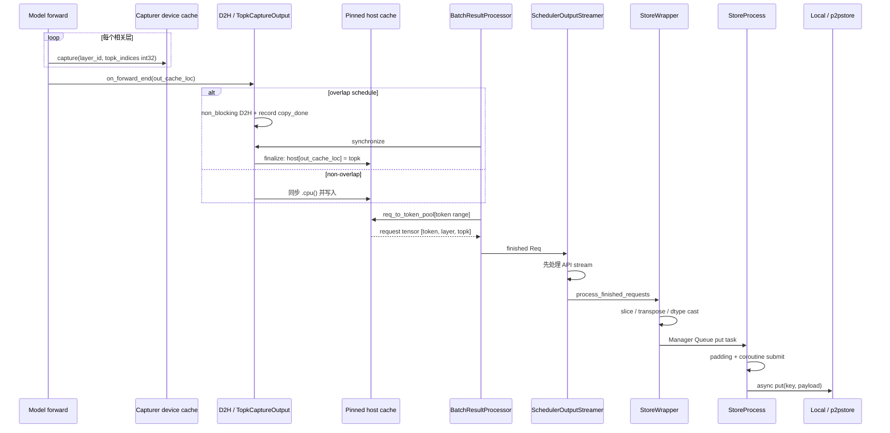
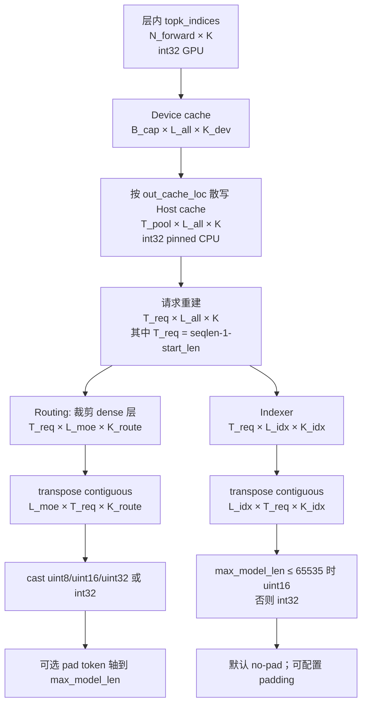
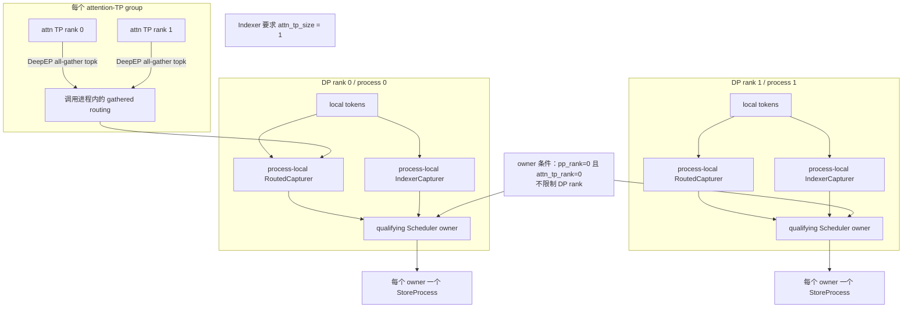
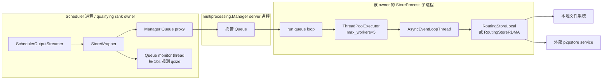

****# R3 Routing / Indexer Replay 深入解析（面向 RL 接入与维护）

> 基线：当前仓库 `internal/release/1.0.0`，提交 `bcc27e770f5b61e557de57b45679dedceee219a7`（2026-07-10）。本文行号均按该提交核对。
>
> **命名边界**：当前仓库没有给出可核实的 “R3” 官方英文全称，本文不自行扩写。**R3 不是模型**；这里的 R3 是一条把推理 forward 中的 MoE routing / DSA indexer top-k 捕获、按请求重建并写入 RL replay 存储的工程链路。

## 0. 阅读标记与结论先行

本文用三种标记避免把静态阅读当成运行事实：

- **【源码确认】**：可由当前提交直接证明，附相对路径与准确行号。
- **【代码推断】**：由多个代码点组合得到，但没有端到端运行证据。
- **【待运行验证】**：与外部包、并发时序、硬件后端或部署拓扑有关，必须实测。

核心结论：

1. **【源码确认】** R3 producer 的两类 replay 是：MoE routed expert ID 与 DSA/indexer top-k index；默认只启用 `routing`，可通过 `replay_kinds` 加入 `indexer`（`python/sglang/srt/internal/r3_plugin/config.py:6-7,24-40`）。
2. **【源码确认】** forward 先写 GPU `int32` device cache，结束后按 `out_cache_loc` 落到 pinned CPU host cache；请求结束时再借助 `req_to_token_pool` 重建逻辑 token 顺序（`python/sglang/srt/state_capturer/base.py:20-42,54-66,79-95,145-184`）。
3. **【源码确认】** API 返回协议和 R3 store 协议不是同一种 wire format：API 是原始 `int32` tensor 的 base64；store 会转为 layer-first、可能压缩 dtype、可能 padding，并可 fused/per-layer 写入（`python/sglang/srt/managers/detokenizer_manager.py:385-407`；`python/sglang/srt/internal/r3_plugin/routing_store.py:309-337,363-386,464-481`）。
4. **【源码确认】** R3 RDMA backend 直接导入外部 `p2pstore.P2PClient/P2PConfig`。Mooncake 相关代码至少包含两条独立路径：PD disaggregation 使用的 `mooncake.engine.TransferEngine`，以及 HiCache 使用的 Mooncake storage backend。**R3 local/p2pstore 不属于、也不直接调用其中任一路径**（`python/sglang/srt/internal/r3_plugin/routing_store.py:700-715`；`python/sglang/srt/distributed/device_communicators/mooncake_transfer_engine.py:99-117`；`python/sglang/srt/mem_cache/storage/backend_factory.py:165,203-207`）。若外部安装的 `p2pstore` 包内部另有依赖，属于【待运行验证】，不能反向改写本仓库事实。
5. **【源码确认】** 当前 HEAD 已不在 `StoreProcess.run()` 启动时自动清库；`run()` 直接构造 backend、启动事件循环并消费队列（`python/sglang/srt/internal/r3_plugin/routing_store.py:427-462`）。

---

## 1. 定位与非目标

### 1.1 它解决什么问题

RL rollout 生成过程中，训练侧有时不仅需要 token/logprob，还需要复现模型实际做出的稀疏选择：

- MoE 每层每 token 路由到了哪些 routed experts；
- DSA/indexer 每层每 token 选择了哪些历史 token position。

R3 链路在 serving forward 热路径旁路捕获这些整数索引，利用 KV token slot 映射在请求结束时恢复请求顺序，然后异步写入本地文件或外部 p2pstore。

### 1.2 明确非目标

- 不是模型、模型权重格式或训练算法；
- 不是 KV cache 存储，也不是 HiCache/Mooncake backend；
- 不在 store payload 中保存 logits、hidden states、token 文本或完整训练样本；
- 不提供仓库内 RL reader/consumer 实现，也不写 manifest/schema sidecar；consumer 必须与 producer 配置达成约定；
- 不保证仅凭 fused bytes 自描述 dtype、shape、真实长度与模型层映射。

### 1.3 整体架构与组件图

整体架构分为五段：forward producer、GPU/CPU 两级 capturer、请求级重建、OutputStreamer 分流、独立进程异步持久化。当前 R3 backend 接口只有 put/clear/delete，没有 get 或把 replay 决策重新注入 model forward 的路径（`python/sglang/srt/internal/r3_plugin/routing_store.py:624-650`）；因此本仓库实现的是 rollout 侧采集与导出，真正的 RL 读取/消费位于仓库外或当前分支未提供。

```mermaid
flowchart LR
    Req[RL rollout 请求<br/>rid + sampling] --> Sch[Scheduler / Req]
    Sch --> MR[ModelRunner forward]
    MR --> MoE[MoE top-k]
    MR --> DSA[DSA / Indexer top-k]
    MoE --> RDC[RoutedExpertsCapturer]
    DSA --> IDC[IndexerTopkCapturer]
    RDC --> Dev[GPU int32 device cache]
    IDC --> Dev
    Dev -->|D2H + out_cache_loc| Host[Pinned CPU host cache]
    Host -->|req_to_token_pool 重建| ReqTensor[请求级 int32 tensor]
    ReqTensor --> Stream[SchedulerOutputStreamer]
    Stream -->|可选携带 tensor| IPC[BatchTokenIDOutput / IPC]
    IPC --> Detok[DetokenizerManager]
    Detok --> B64[raw int32 bytes + base64 / meta_info]
    Stream -->|finished request| SW[StoreWrapper]
    SW --> Q[Manager Queue]
    Q --> SP[StoreProcess]
    SP --> Local[Local .pt]
    SP --> P2P[外部 p2pstore]

    Boundary[边界：Mooncake PD 与 HiCache Mooncake Store 是独立路径，不参与 R3]
```



---

## 2. 配置入口与启用语义

### 2.1 CLI

**【源码确认】** 入口参数位于：

- `--enable-return-routed-experts`：`python/sglang/srt/server_args.py:6806-6810`；
- `--enable-return-indexer-topk`：`python/sglang/srt/server_args.py:6811-6815`；
- `--enable-r3-p2pstore`：`python/sglang/srt/server_args.py:6816-6821`；
- `--r3-p2pstore-config` 及 JSON key 清单：`python/sglang/srt/server_args.py:6822-6831`；
- `--enable-r3-for-draft-worker`：`python/sglang/srt/server_args.py:6833-6839`。

典型配置（JSON 必须作为一个 CLI 字符串传入）：

```bash
--enable-r3-p2pstore \
--r3-p2pstore-config '{
  "routing_store_type": "rdma",
  "rdma_store_server": "<metadata-server>",
  "use_fused_put": true,
  "only_last_turn": false,
  "routing_no_pad": false,
  "indexer_no_pad": true,
  "replay_kinds": ["routing", "indexer"],
  "routing_debug": false
}'
```

**【源码确认】** JSON parser 只接受 object/dict；空值返回空 dict，非 object 抛错（`python/sglang/srt/internal/r3_plugin/config.py:10-21`）。`replay_kinds` 只能是由 `routing`/`indexer` 构成的 list/tuple/set，字符串本身不合法（同文件 `:24-40`）。

**【源码确认】** 当 `enable_r3_p2pstore` 为真时，`replay_kinds` 会隐式打开对应 capturer：`routing` 设置 `enable_return_routed_experts`，`indexer` 设置 `enable_return_indexer_topk`（`python/sglang/srt/server_args.py:1212-1218`）。名字虽然含 `return`，但 Req 构造处把“是否返回 API”与“是否 capture”分开：单请求 return flag 控制返回，server flag 也能单独驱动 capture（`python/sglang/srt/managers/scheduler.py:1965-1984`）。

### 2.2 JSON key 与默认值

| key | 默认值 | 作用 |
|---|---:|---|
| `routing_store_type` | `local` | `local` 或 `rdma` |
| `local_store_dir` | `./routing_replay_output` | 本地根目录 |
| `rdma_store_server` | `""` | 传给 `P2PConfig(metadata_server=...)` |
| `use_fused_put` | `true` | 一请求一种 replay 一次写 3-D；否则逐层写 2-D |
| `only_last_turn` | `false` | 先入队当前 turn 的 put，再入队同 segment 上一 turn 的 delete；backend 完成顺序不保证 |
| `routing_no_pad` | `false` | 默认 routing 补到 `max_model_len` |
| `indexer_no_pad` | `true` | 默认 indexer 不补齐 |
| `replay_kinds` | `["routing"]` | 捕获/存储种类 |
| `routing_debug` | `false` | 用 position ID 替代 routing top-k 验证链路 |

工厂读取这些值并启动 wrapper：`python/sglang/srt/internal/r3_plugin/routing_store.py:845-901`。backend 只接受 `local`/`rdma`（同文件 `:754-764`）。

---

## 3. Capturer：device buffer、host buffer 与 forward 生命周期

### 3.1 通用缓存

**【源码确认】** `BaseDeviceCache` 分配：

```text
[max_batch_size, num_layers, topk_size], torch.int32, accelerator device
```

每层执行 `buffer[:batch, layer_id, :] = topk_indices`（`python/sglang/srt/state_capturer/base.py:20-42`）。

**【源码确认】** `BaseHostCache` 分配：

```text
[num_tokens, num_layers, topk_size], torch.int32, CPU, pin_memory=True
```

见 `python/sglang/srt/state_capturer/base.py:54-66`。这意味着容量成本为：

```text
num_tokens × num_layers × topk_size × 4 bytes × capturer/进程数
```

Indexer 的 `index_topk` 往往很大，host pinned memory 是首要容量风险。公开测试专门把 `max-total-tokens` 限为 32768，并注明 DS V3.2 约 488 KB/token，否则多进程可达 TB 级（`test/registered/rl/test_return_indexer_topk.py:52-67`）。

### 3.2 overlap 与非 overlap

**【源码确认】** forward 结束时，`ModelRunner` 根据 `disable_overlap_schedule` 决定是否延迟 D2H（`python/sglang/srt/model_executor/model_runner.py:3503-3518`）：

- overlap：`on_forward_end(..., no_copy_to_cpu=True)` 返回 `TopkCaptureOutput`；scheduler forward stream 中异步 `.to("cpu", non_blocking=True)`，随后记录 `copy_done`（`python/sglang/srt/managers/utils.py:75-122`；`python/sglang/srt/managers/scheduler.py:3088-3101`）；结果处理先 synchronize，再 `finalize()` 写 host cache（`python/sglang/srt/managers/scheduler_components/batch_result_processor.py:178-193`）。
- 非 overlap：`on_forward_end()` 直接 `.cpu()` 并按 `out_cache_loc` 写 host cache（`python/sglang/srt/state_capturer/base.py:162-184`）。

### 3.3 forward 到 store 时序图



---

## 4. MoE routed experts

### 4.1 producer hook 与 fused shared experts

**【源码确认】** MoE top-k 后处理在 `_post_process_topk_ids()` 内把 `topk_ids` 交给全局 capturer（`python/sglang/srt/layers/moe/topk.py:1459-1476`）。

`RoutedExpertsCapturer` 的逻辑 top-k 是 `num_experts_per_tok`，层数取 `num_hidden_layers`（`python/sglang/srt/state_capturer/routed_experts.py:51-83`）。若 shared experts 被融合到 MoE top-k，device buffer 可多出 `num_fused_shared_experts` 列，但 `_get_local_slice()` 在进 host cache 前只保留 `:self.topk_size`；因此 RL replay 面向 routed experts，不把 fused shared columns 暴露出去（同文件 `:20-27,75-83,138-140`）。

不要混淆两种 “fused”：

- **fused shared experts**：device top-k 额外列，host/replay 截掉；
- **`use_fused_put`**：store 把所有层合成一个 3-D payload。

### 4.2 MoE 层裁剪

**【源码确认】** 请求级 capture 含 `num_hidden_layers` 槽。store 前通过 `moe_layer_start` 去掉前导 dense 层，再转成 layer-first（`python/sglang/srt/internal/r3_plugin/routing_store.py:317-329`）。起始层优先读 `moe_layer_start_index`，其次 `first_k_dense_replace`，否则 0；MoE 层数为 `num_hidden_layers - moe_layer_start`（同文件 `:772-787`）。

**消费注意**：per-layer key 中的 `layer_id` 是裁剪后数组的 0-based slot，不一定等于原 transformer layer ID。

---

## 5. DSA / Indexer top-k

### 5.1 producer 与 skip-topk

**【源码确认】** `maybe_capture_indexer_topk()` 以 side effect 写 capturer，同时原样返回 tensor（`python/sglang/srt/state_capturer/indexer_topk.py:58-70`）。DSA CUDA indexer 多个返回路径都调用该 hook，例如 `python/sglang/srt/layers/attention/dsa/dsa_indexer.py:1375-1392`。

某些 indexer 层因 `skip_topk` 复用上一层结果；代码会把复用结果也写入当前层 slot，确保 replay 与真正使用值一致（`python/sglang/srt/models/deepseek_common/attention_forward_methods/forward_mla.py:245-290`）。公开测试检查偶数层与前一层 byte-equal（`test/registered/rl/test_return_indexer_topk.py:104-116`）。

### 5.2 限制

- **【源码确认】** `IndexerTopkCapturer` 断言 attention TP size 必须为 1，并明确当前只支持 DP attention（`python/sglang/srt/state_capturer/indexer_topk.py:28-34`）。
- **【源码确认】** producer wiring 仅 CUDA；其他 device 会 warning 并禁用（`python/sglang/srt/model_executor/model_runner.py:947-961`）。
- **【源码确认】** indexer host reconstruction 当前没有 start offset，总是使用 `start_len=0`（`python/sglang/srt/managers/scheduler_components/batch_result_processor.py:146-155`）。

---

## 6. Tensor shape：从 layer hot path 到 consumer



**【源码确认】** `get_topk()` 取 request token slots 的区间为 `[start_len, seqlen-1)`（`python/sglang/srt/state_capturer/base.py:145-160`），因此最后一个 sequence position 不出现在 replay 中。routing result processor 还显式校验期望行数 `max(0, seqlen-1-start_len)`（`python/sglang/srt/managers/scheduler_components/batch_result_processor.py:101-144`）。

API 侧公开 shape：

- routing base64 解回 `int32` 后为 `[max(0, seqlen-1-routed_experts_start_len), routing_layers, experts_per_token]`；start-len 为 0 时可简写为 `[seqlen-1, ...]`。GLM 测试覆盖零起点（`test_internal/e2e/test_glm45_air_routing_replay.py:123-142`），非零起点断言见 `test/registered/rl/test_return_routed_experts.py:428-454`；
- indexer 为 `[seqlen-1, num_indexer_layers, index_topk]`（`test/registered/rl/test_return_indexer_topk.py:95-102,136-141`）。

---

## 7. DP、DeepEP、CUDA Graph、draft worker、PP/TP 约束

### 7.1 Rank ownership 图



### 7.2 DP 与 DeepEP

- **【源码确认】** routing device capacity 乘 `dp_size`，用于覆盖 DP-concatenated batch；代码仍有 FIXME：spec decoding 的 `num_verify_tokens` 未计入（`python/sglang/srt/state_capturer/routed_experts.py:64-73`）。
- **【源码确认】** 非 DeepEP 的 DP attention 用 `get_dp_local_slice_cpu()` 得到该 DP rank 的 token 段，避免 GPU→CPU sync 破坏 overlap（同文件 `:121-140`）。
- **【源码确认】** DeepEP 下每个 attention-TP rank 只看到 scattered top-k，capture 前执行 attention-TP all-gather，并预分配 gather buffer（同文件 `:85-119`）。
- **【代码推断】** routing 的 DeepEP 路径有明确修复逻辑；indexer 没有对应 DeepEP gather，但其硬约束 `attn_tp_size==1` 把该问题挡在配置边界之外。

### 7.3 CUDA Graph 与 routing_debug

**【源码确认】** `routing_debug` 预分配 graph-safe 固定 buffer（`python/sglang/srt/state_capturer/routed_experts.py:89-96`），用 position ID 填充每个 top-k 列；DP + CUDA Graph 时按 graph bucket capacity 计算 rank offset（`python/sglang/srt/internal/r3_plugin/routing_debug.py:16-47`；`python/sglang/srt/model_executor/cuda_graph_runner.py:1159-1162`）。store 前逐元素核对 layer/token/k 是否等于期望 position，失败抛 `ValueError`（`python/sglang/srt/internal/r3_plugin/routing_store.py:339-361`）。

这是一种链路完整性测试，不是正常 routing 语义；开启后 routing dtype 强制 `int32`（同文件 `:63-79`）。

### 7.4 Draft worker / speculative decoding

- **【源码确认】** draft worker 默认禁用 R3 capture；只有 `--enable-r3-for-draft-worker` 才允许（默认值与 CLI 见 `python/sglang/srt/server_args.py:796-800,6833-6840`；执行分支见 `python/sglang/srt/model_executor/model_runner.py:899-923`）。
- **【源码确认】** draft forward 期间可暂时把两个全局 capturer 置空，防止 draft 覆盖 main model buffer或在 CUDA Graph 中触发非法 D2H（同文件 `:903-919`）。
- **【源码确认】** routed capturer 的 capacity 对 spec verify tokens 仍有 FIXME（`python/sglang/srt/state_capturer/routed_experts.py:69`）。
- **【待运行验证】** 若主动打开 draft R3，必须分别验证 main/draft 的层数、top-k、buffer ownership 与最终 store 语义；不要假设它自动表示“主模型最终采用的路由”。

### 7.5 PP / TP

- **【源码确认】** store wrapper 只在 `pp_rank==0 && attn_tp_rank==0` 初始化（`python/sglang/srt/managers/scheduler.py:586-602`）。
- **【源码确认】** `TPWorker.forward_batch_generation()` 仅在 PP last rank 将 `routed_experts_output/indexer_topk_output` 放入 `GenerationBatchResult`（`python/sglang/srt/managers/tp_worker.py:471-483`）。
- **【代码推断】** PP>1 时，“store owner 在 PP rank 0”与“capturer output 由 PP last rank 返回”之间的完整汇聚关系不能仅从上述两点证明；各 PP stage 只持有部分层也会影响 host tensor 完整性。
- **【待运行验证】** 把 PP>1 视为未证实拓扑：至少验证最终层维度、每层是否非零/非旧数据、store 是否由正确进程提交。Indexer 还额外要求 attention TP=1；routing TP/DeepEP 则按上一节处理。

---

## 8. 请求重建与 OutputStreamer

### 8.1 请求重建

Req 结束时，实际序列长度用：

```python
seqlen = len(req.origin_input_ids) + len(req.output_ids_through_stop)
```

routing 使用 `routed_experts_start_len`，indexer 从 0 开始（`python/sglang/srt/managers/scheduler_components/batch_result_processor.py:101-155`）。重建不是从一块连续 request buffer 直接切片，而是先查：

```text
req_to_token_pool.req_to_token[req_pool_idx][start_len : seqlen - 1]
```

再索引 host cache（`python/sglang/srt/state_capturer/base.py:145-160`）。这一步把 KV/token-pool 物理 slot 恢复为请求逻辑 token 顺序。

当请求设置 `return_routed_experts=true` 时，`routed_experts_start_len` 必须位于 `[0, prompt token 数]`，否则请求 abort（`python/sglang/srt/managers/scheduler.py:2146-2165`）。Indexer 当前无对应 start-len 字段。

### 8.2 SchedulerOutputStreamer

类的准确名称是 `SchedulerOutputStreamer`（`python/sglang/srt/managers/scheduler_components/output_streamer.py:37-49`）。`stream_output()` 顺序为：

1. 先走 generation/embedding output；
2. 若有 wrapper，再处理 finished requests 并送 store；
3. 最后执行测试 crash trigger。

见同文件 `:94-113`。

API accumulator 只有在单请求 return flag 为真时才附带 replay tensor（同文件 `:134-145,471-478`），而 R3 store 检查的是已 capture/reconstruct 的 `req.routed_experts` / `req.indexer_topk` 与 `replay_kinds`（`python/sglang/srt/internal/r3_plugin/routing_store.py:282-307`）。所以“存了”不等于“HTTP 返回了”。

**【源码确认】** `_r3_store_submitted` 在真正转换/入队前先设为真，用于防 overlap 重复提交（同文件 `:282-303`）。若随后失败，非 debug 模式只 warning，后续也不会自动重试（同文件 `:303-307`）。

---

## 9. StoreWrapper / StoreProcess 与进程边界

### 9.1 进程边界图



**【源码确认】** 每个满足 `pp_rank==0 && attn_tp_rank==0` 的 Scheduler 都独立创建 `StoreWrapper`，而每个 wrapper 创建 `multiprocessing.Manager().Queue` proxy、monitor thread 与自己的 `StoreProcess`（`python/sglang/srt/managers/scheduler.py:586-602`；`python/sglang/srt/internal/r3_plugin/routing_store.py:91-134,162-190`）。`Manager` 本身有独立 server 进程；因此在 DP attention 或多副本部署中可能存在多个 qualifying owner/store process，并非部署级单例。队列容量公式是 `num_moe_layers * max_num_seqs * 1000`（`routing_store.py:105-108`）。R3 key/path 不自动加入 DP rank，训练侧必须保证这些 producer 之间 RID 全局唯一，或明确设计其聚合/分片规则。

**【源码确认】** 子进程内是 5-worker thread pool + 独立 asyncio event loop thread；task 支持 `put`、`clear_store`、`clear_prefix_batch`（同文件 `:404-462,569-621`）。padding 在子进程 `process_put_task()` 内完成（同文件 `:464-481`）。

 StoreProcess 的作用
                                                                                                       
  位于 python/sglang/srt/internal/r3_plugin/routing_store.py:408，它是 R3（Routing                
  Replay）插件里一个独立的后台进程，专门用来把 MoE routing / indexer                                   
  数据异步写到存储后端，避免阻塞主推理进程。                                                           
                                                                                                       
  在整体架构中的位置                                                                                   
                                                                                                   
  主进程通过 StoreWrapper（routing_store.py:91）持有一个 multiprocessing.Manager().Queue()，把要落盘/落
   RDMA 的任务塞进去；StoreProcess 作为子进程从队列拉任务并执行。数据流大致：

  Scheduler/主进程 请求完成
      → StoreWrapper.process_finished_requests()   (routing_store.py:282)
      → 把 routing/indexer numpy 数据封成 StoreTask
      → 塞进 multiprocessing Queue
      ─────────── 进程边界 ───────────
      → StoreProcess.run()                          (routing_store.py:431)
      → ThreadPoolExecutor(max_workers=5)
      → RoutingStoreLocal / RoutingStoreRDMA (p2pstore)

  具体职责（routing_store.py:408-570）

  1. 子进程隔离 — 继承 multiprocessing.Process，run() 在独立进程中执行。这样 pad、序列化、RDMA/磁盘 IO
  都不会占用推理进程的 GIL 和 CPU。
  2. 懒初始化存储后端 — 在 run() 里才调用 get_routing_store()（routing_store.py:434）创建
  RoutingStoreLocal 或 RoutingStoreRDMA。因为 RDMA 的 P2PClient 有 fork 安全问题，必须在子进程内构造。
  3. 异步事件循环 — 内部再起一个 AsyncEventLoopThread（routing_store.py:438,573），把 RoutingStoreBase
  那些 async def put/clear 协程用 run_coroutine_threadsafe 提交到该 loop。
  4. 多线程消费 — 主循环用
  ThreadPoolExecutor(max_workers=5)（routing_store.py:443）从队列拉任务并派发到 3 类处理函数：
    - process_put_task         — 存 routing/indexer 索引（routing_store.py:468）
    - process_clear_store_task — 清空整个 store（routing_store.py:491）
    - process_clear_prefix_batch_task — 按前缀清除，用于多轮对话回收上一轮（routing_store.py:505）
    - 收到 None sentinel 时优雅退出（routing_store.py:447）
  5. 数据后处理 — pad_routing_indices()（routing_store.py:539）按 max_model_len 做 padding；unsigned
  dtype 用 iinfo.max 作为 fill，int 用 -1。是否 pad 由 routing_no_pad / indexer_no_pad 控制。

  为什么单独开进程而不是线程

  - Routing 索引数据量可能很大（queue_max_size = num_moe_layers * max_num_seqs * 1000，见
  routing_store.py:108），持续 IO 会抢主进程 CPU。
  - RDMA 的 p2pstore.P2PClient 需要在 fork 之后的干净进程里初始化。
  - Python GIL 下，纯线程做序列化 + torch.save 会明显拖慢调度线程。

  一句话总结：StoreProcess 是 R3 replay 数据落地的后台工作进程，从主进程接收 routing/indexer
  数据任务队列，异步落到本地文件系统或 RDMA p2pstore，用于 RLHF 场景下重放路由决策。

### 9.2 并发与完成语义风险

- **【代码推断】** 绑定在 executor future 完成回调上的 `_task_queue.task_done()` 只表示 worker 已完成预处理并把 coroutine 提交给 event loop，不等于 backend put 已完成或持久化（`python/sglang/srt/internal/r3_plugin/routing_store.py:439-457,464-481`）。
- **【代码推断】** async callback 没有调用 `future.result()`；它进入 callback 就记录 completed，backend coroutine 异常可能未被正确观察（同文件 `:518-528`）。
- **【代码推断】** put 与 previous-turn delete 可经不同 worker 并发提交，没有 producer 侧显式顺序 barrier。
- **【待运行验证】** backend 故障、快速 shutdown、同 RID 并发、put/delete 顺序和 durability 必须注入故障实测。

---

## 10. Local 与 p2pstore：key、value 和边界

### 10.1 Local backend

**【源码确认】** 文件布局（`python/sglang/srt/internal/r3_plugin/routing_store.py:653-687`）：

```text
# fused
{local_store_dir}/{rollout_id}/{replay_kind}/{rollout_id}.pt

# per-layer
{local_store_dir}/{rollout_id}/{replay_kind}/layer_{layer_id}.pt
```

内容通过 `torch.save(torch.from_numpy(array), path)` 写入，保留 store 阶段 dtype/shape。没有 sidecar metadata。`clear_store` 删除整个根目录；`clear_prefix_batch` 对 local 明确 `NotImplementedError`（同文件 `:689-697`）。因此 `local + only_last_turn` 不能视为已支持。

### 10.2 p2pstore / RDMA backend

**【源码确认】** RDMA backend：

```python
from p2pstore import P2PClient, P2PConfig
P2PClient(P2PConfig(metadata_server=rdma_store_server))
```

见 `python/sglang/srt/internal/r3_plugin/routing_store.py:700-715`。该外部包不在仓库中，per-layer ndarray 的具体 wire serialization 无法由本仓库确认。

key 规则（同文件 `:716-743,767-769`）：

| replay | fused key | per-layer key |
|---|---|---|
| routing | `{rid}` | `{rid}_{layer_id}` |
| indexer | `indexer:{rid}` | `indexer:{rid}_{layer_id}` |

value 规则：

- fused 3-D ndarray 显式 `.tobytes()` 后 put；
- per-layer 2-D ndarray 直接传给 `P2PClient.put()`。

**【待运行验证】** consumer 必须在真实 p2pstore 版本上确认 2-D ndarray 的序列化格式；不要把 fused raw bytes 与 per-layer ndarray 当成完全相同的 wire contract。

### 10.3 为什么 p2pstore 不是 Mooncake

当前仓库中：

- R3 只在 `python/sglang/srt/internal/r3_plugin/routing_store.py:706-714` 导入 `p2pstore`；
- Mooncake 由 HiCache backend factory 的 `backend_name == "mooncake"` 独立选择（`python/sglang/srt/mem_cache/storage/backend_factory.py:165`），实现类是 `MooncakeStore`（`python/sglang/srt/mem_cache/storage/mooncake_store/mooncake_store.py:302`）；
- R3 plugin 目录没有 Mooncake import 或适配代码。

所以本文明确采用：**p2pstore 不是 Mooncake**。最多只能说“外部 p2pstore 包内部是否间接使用某组件未知”，那需要检查部署环境的 `p2pstore.__file__`、package metadata、依赖和已加载 so，属于【待运行验证】。

---

## 11. Dtype、padding、fused 与 last-turn 协议

### 11.1 Routing dtype

`compute_routing_dtype()`（`python/sglang/srt/internal/r3_plugin/routing_store.py:63-79`）：

| 条件 | store dtype |
|---|---|
| `routing_debug=true` | `int32` |
| expert count 未知/≤0 | `int32` |
| `num_routed_experts + 1 <= 256` | `uint8` |
| `num_routed_experts + 1 <= 65536` | `uint16` |
| 其他 | `uint32` |

容量阈值按 `num_routed_experts + 1` 计算；源码把额外值注释为 “for training”，其具体训练侧协议含义需要与外部 consumer 核实，不能仅凭后续 padding 逻辑断定为 sentinel 预留。shared experts 不参与该 dtype 阈值计算；`num_experts` 只用于 `<=0` 的有效性回退判断（同文件 `:63-79`）。API 返回仍是 capture 的 `int32`，不受此压缩影响。

### 11.2 Indexer dtype

**【源码确认】** 若 `max_model_len <= 65535`，indexer store cast 为 `uint16`，否则保持 `int32`（`python/sglang/srt/internal/r3_plugin/routing_store.py:331-337`）。capture/API 中允许 `-1` padding sentinel（`test/registered/rl/test_return_indexer_topk.py:95-102`）；cast 后其 bit pattern 对应 `65535`。store 不携带 sentinel metadata，consumer 必须按协议解释。

### 11.3 Padding

**【源码确认】** 默认 routing pad、indexer no-pad。padding 目标 token 长度是 `max_model_len`：

- 2-D `[token, topk]` pad axis 0；
- 3-D `[layer, token, topk]` pad axis 1；
- unsigned fill=`np.iinfo(dtype).max`，signed fill=`-1`。

见 `python/sglang/srt/internal/r3_plugin/routing_store.py:464-471,535-566`。

**【代码推断】** 协议没有单独写入显式 token-length 字段。启用 padding 时，consumer 应从 rollout metadata 取得真实长度，或在 sentinel 不与合法值冲突时扫描 sentinel；no-pad payload 可由 local/per-layer tensor shape，或由 fused raw byte length 加已知的层数、top-k 与 dtype 推导长度。只有在该 replay kind 启用 padding且 token 维超过 `max_model_len` 时，当前实现才会构造负 padding dimension 并失败，且没有友好前置校验。

### 11.4 Fused / per-layer

`use_fused_put=true` 一次提交 `[layer, token, topk]`；false 时循环每层提交 `[token, topk]`（`python/sglang/srt/internal/r3_plugin/routing_store.py:363-386`）。这不仅影响吞吐，也改变 key、local 文件和 p2pstore value 类型。

### 11.5 only-last-turn

RID 必须满足：

```text
<prefix>:<gen_id>:<turn_id>:<segment_id>
```

使用 `rsplit(":", 3)`，因此 prefix 自身可以含冒号；仅 turn/segment 必须为非负整数（`python/sglang/srt/internal/r3_plugin/routing_store.py:815-836`）。当前 turn `T>0` 时，要删的 key 是同 prefix/gen/segment 的 `T-1`；turn 0 不删（同文件 `:388-401`）。

注意：

- 只删“紧邻上一 turn + 同 segment”，不是删全部历史；
- 方法名虽为 `clear_prefix_batch`，RDMA 实现实际是 `delete_batch([exact_key])`（同文件 `:734-743`）；
- per-layer 会逐层生成上一 turn key；
- local 没实现该删除：delete coroutine 会以 `NotImplementedError` 失败，而 completion callback 不读取 future 结果，日志仍可能误报完成；
- 普通自动 UUID 不符合此 RID 协议。

---

## 12. RL consumer 协议清单

仓库没有 reader，因此接入双方至少要固化以下契约：

1. **RID**：训练侧生成并透传；若 only-last-turn，遵守四段尾部格式。
2. **replay kind**：routing 无 namespace，indexer 有 `indexer:`（仅 p2pstore key）；local 使用子目录。
3. **fused 模式**：决定一个 3-D value 还是每层一个 2-D value。
4. **shape**：
   - routing fused：`[L_moe, T_or_max_len, K_route]`；
   - indexer fused：`[L_indexer, T_or_max_len, K_index]`；
   - per-layer：`[T_or_max_len, K]`。
5. **层映射**：routing slot 0 对应 `moe_layer_start`；indexer slot 对应 capturer 的 indexer-layer顺序。
6. **dtype**：routing 按 expert count/debug 推导；indexer 按 `max_model_len` 推导。
7. **真实长度**：协议不写独立长度字段；padding 模式应由 rollout metadata 提供真实长度（或在无值冲突时扫描 sentinel），no-pad 模式还可由 tensor shape或 raw byte length + 已知维度/dtype 推导。
8. **padding/sentinel**：routing 默认 pad；indexer 默认不 pad；unsigned max 与 signed `-1`。
9. **字节序/布局**：提交前内存布局为 C-contiguous、layer-first；RDMA fused value 使用 `.tobytes()` 形成 raw bytes，local fused value 通过 `torch.save()` 保留 dtype/shape。RDMA per-layer ndarray 的 wire serialization 取决于目标 p2pstore 版本。producer 没写显式 endian/schema version，异构 consumer 应实测并固定。
10. **最后位置缺失**：replay token 轴对应 `[start_len, seqlen-1)`；routing 可配置 start，indexer 固定 0。
11. **shared expert**：fused shared columns 已从 replay 移除。
12. **模型身份/schema 版本**：当前 key/value 不含，建议由 RL 上层 manifest 绑定 model revision、层数、top-k、配置与 producer commit。

一个安全的 consumer 伪流程：

```text
读取 rollout manifest
→ 构造 routing/indexer key
→ fetch bytes/tensor
→ 按协商 dtype 解码
→ 按 fused/per-layer 与 L/T/K reshape
→ 去 padding（使用真实 T，不只扫描 sentinel）
→ 将 routing slot 映射回 transformer layer
→ 校验值域、shape、RID、model revision
→ 交给 RL loss / replay pipeline
```

---

## 13. 调试、测试、风险与排障

### 13.1 建议排障顺序

1. **配置是否真正启用**：日志应有 `Routing store initialized`；它可核对 replay kinds、routing dtype、`routing_no_pad` 与 max model length（`python/sglang/srt/internal/r3_plugin/routing_store.py:895-900`）。`indexer_no_pad`、`use_fused_put`、`only_last_turn` 未打印，必须直接核对 JSON 配置。
2. **capturer 是否创建**：indexer 非 CUDA 会被禁；attention TP≠1 会 assert（`python/sglang/srt/model_executor/model_runner.py:947-975`；`python/sglang/srt/state_capturer/indexer_topk.py:28-29`）。
3. **内存是否合理**：查 `DeviceCache[...] allocated` 与 `HostCache[...] allocated` shape/MB/GB 日志（`python/sglang/srt/state_capturer/base.py:43-76`）。
4. **请求是否 capture**：Req 的 capture flag 是 request return 或 server enable 的 OR（`python/sglang/srt/managers/scheduler.py:1977-1984`）。
5. **请求是否 finish 并重建**：关注 routing row-count mismatch warning（`python/sglang/srt/managers/scheduler_components/batch_result_processor.py:128-144`）。
6. **是否被过滤**：health-check RID、`skip_req`、已提交 marker 都会跳过（`python/sglang/srt/internal/r3_plugin/routing_store.py:282-303`）。
7. **队列是否拥塞**：超过 80% 有 warning；满队列直接 RuntimeError/drop（同文件 `:176-224`）。
8. **shape/dtype 是否按 store 规则变化**：先与 API int32 tensor 对齐，再验证 slice/transpose/cast/pad。
9. **backend 是否真实完成**：不要只看 “Async task completed”；注入 fetch/read-back 或 checksum 验证。
10. **分布式拓扑**：逐 rank 打印 token/layer shape，特别检查 DeepEP、CUDA Graph bucket、PP>1、draft enable。

### 13.2 已有测试覆盖

- routing API/capture：GLM 4.5 Air，覆盖 cold/聚合 cache-hit 与 EAGLE，并以 HiCache 配置启动、与 baseline 比较（`test_internal/e2e/test_glm45_air_routing_replay.py:35-73,123-199`）；测试只断言聚合 `cached_tokens > 0`，没有单独证明命中来自 HiCache storage backend。
- indexer API/capture：DS V3.2，覆盖 DP attention、shape/range、`index_topk_freq=2` 的复用层（`test/registered/rl/test_return_indexer_topk.py:20-30,35-68,90-141`）。

**【源码确认】** 上述测试都没有启用 `--enable-r3-p2pstore`，因此未覆盖 StoreWrapper/StoreProcess、local/RDMA key、压缩 dtype、padding、last-turn。

### 13.3 高风险清单

| 风险 | 判定 | 建议验证 |
|---|---|---|
| Indexer pinned host memory 爆炸 | 源码+测试确认 | 启动前按公式估算；限制 max-total-tokens |
| spec verify token 未计入 routing capacity | 源码 FIXME | 长 verify / 大 batch 压测与越界检查 |
| PP>1 ownership/层完整性 | 代码推断 | 每 PP rank 与最终 store 对账 |
| async backend 异常未观察 | 代码推断 | 注入 put/delete failure，检查 future/result |
| shutdown 前 coroutine 未 durable | 代码推断 | 写后立即退出再 read-back |
| local + only_last_turn | 源码确认不完整 | 禁用组合或实现/测试 clear_prefix_batch |
| per-layer p2p ndarray wire format | 外部依赖未知 | 对目标 p2pstore 版本抓取并 round-trip |
| 协议无显式 schema/model identity/padding 前真实长度 | 源码确认 | RL 上层增加 manifest 并版本化；local `.pt` 的 shape/dtype 与外部 wire metadata 分开处理 |
| uint16 indexer 的 -1→65535 | 源码确认 | consumer 显式反解 sentinel |
| `_r3_store_submitted` 失败后不重试 | 源码确认+推断 | 指标化失败并由上层补偿 |
| token 超 max_model_len | 代码推断 | 边界测试并前置校验 |
| current HEAD 不自动 clear | 源码确认 | 明确 rollout 生命周期，必要时显式 clear |

### 13.4 最小验证矩阵

至少组合：

- replay：routing / indexer / both；
- backend：local / p2pstore；
- put：fused / per-layer；
- padding：on / off；
- execution：overlap on/off、CUDA Graph on/off；
- topology：单卡、DP、DeepEP、TP、PP>1；
- speculative：draft disabled/default、显式 enabled；
- lifecycle：正常结束、队列满、backend fail、立即 shutdown；
- RID：turn 0/1/2、多 segment、prefix 含冒号、非法 ID。

每个 case 都应做 producer API int32 → store transform → consumer decode 的逐元素对账，而不只检查“key 存在”。

---

## 14. 推荐源码阅读顺序

1. **参数与语义**：`python/sglang/srt/server_args.py:1212-1218,6806-6839`。
2. **R3 JSON parser**：`python/sglang/srt/internal/r3_plugin/config.py:1-45`。
3. **通用 device/host capturer**：`python/sglang/srt/state_capturer/base.py:20-184`。
4. **routing 特化、DP/DeepEP/fused shared**：`python/sglang/srt/state_capturer/routed_experts.py:20-163`。
5. **indexer 特化与 DP-only 约束**：`python/sglang/srt/state_capturer/indexer_topk.py:14-103`。
6. **forward producer hooks**：
   - `python/sglang/srt/layers/moe/topk.py:1459-1489`；
   - `python/sglang/srt/layers/attention/dsa/dsa_indexer.py:1371-1392,1494-1522,1565-1604`；
   - `python/sglang/srt/models/deepseek_common/attention_forward_methods/forward_mla.py:245-290`。
7. **ModelRunner 初始化、draft/CUDA Graph/forward end**：`python/sglang/srt/model_executor/model_runner.py:900-975,3455-3518`。
8. **overlap D2H**：`python/sglang/srt/managers/utils.py:64-122` 与 `python/sglang/srt/managers/scheduler.py:3088-3101`。
9. **请求重建**：`python/sglang/srt/managers/scheduler_components/batch_result_processor.py:101-155,178-235`。
10. **OutputStreamer 分流**：`python/sglang/srt/managers/scheduler_components/output_streamer.py:94-173,322-478,486-534`。
11. **store 全链路**：`python/sglang/srt/internal/r3_plugin/routing_store.py:43-901`，依次看 config → wrapper → process → backend → key/helper → factory。
12. **API base64 对照**：`python/sglang/srt/managers/detokenizer_manager.py:380-407`。
13. **测试作为可执行规格**：`test_internal/e2e/test_glm45_air_routing_replay.py` 与 `test/registered/rl/test_return_indexer_topk.py`。
14. **Mooncake 对照（只为划清边界）**：`python/sglang/srt/mem_cache/storage/backend_factory.py:165,204-206`、`python/sglang/srt/mem_cache/storage/mooncake_store/mooncake_store.py:302`。

---

## 15. 维护者检查表

合入任何 R3 相关改动前，逐项回答：

- device/host/store 三个 shape 是否都写清楚并测试？
- routing 与 indexer 是否分别测试，还是误把一种路径的结论套给另一种？
- DP local slice、DeepEP gather、attention TP 约束是否改变？
- CUDA Graph 固定地址/bucket offset 是否仍正确？
- draft worker 是否可能覆盖 main capturer？
- PP stage 是否拥有完整层数据，store owner 是否拿到它？
- overlap D2H 是否在 `copy_done` 前发起、在 finalize 前同步？
- fused shared expert 列是否仍在 host 前被截掉？
- dense layer 裁剪与 per-layer layer ID 是否保持协议？
- dtype 阈值、padding sentinel、真实长度是否与 consumer 同步？
- fused/per-layer 的 key 与 value 类型是否兼容旧 consumer？
- `only_last_turn` 是否在目标 backend 真正支持且顺序可控？
- backend coroutine 异常与 shutdown durability 是否有观测？
- 是否错误地把 p2pstore 称为 Mooncake？
- 是否更新并运行了真正覆盖 store read-back 的端到端测试？

只要其中任一项无法由源码或运行结果回答，就应标为“待验证”，而不是把推断写成协议事实。
